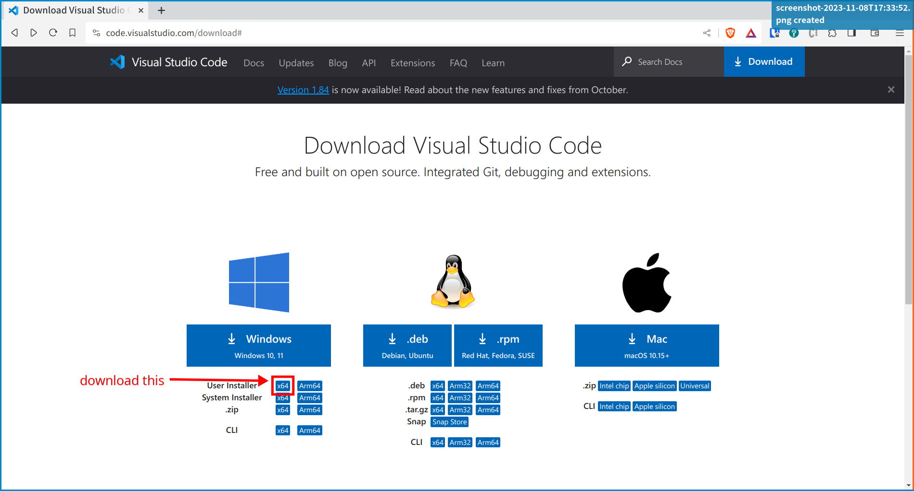

We will be using git from within the [VSCode](https://code.visualstudio.com/).

## Install git

Git for windows can be installed from the DCCN software center.

## Install VSCode

On Windows, VSCode can be installed in user space (no administrator right is required).  On the [VSCode download page](https://code.visualstudio.com/download#), choose the __User Installer (x86)__ option.  See the screenshot below.

## Install VSCode extensions

Search and install the following two extensions in VSCode:

- Hugo language and syntax support
- Front Matter CMS
