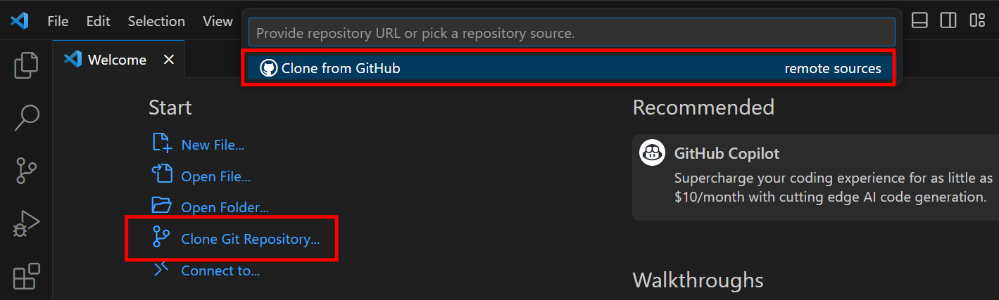
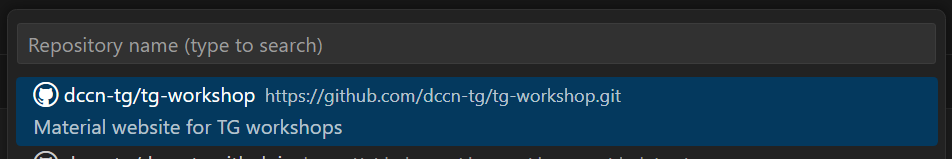
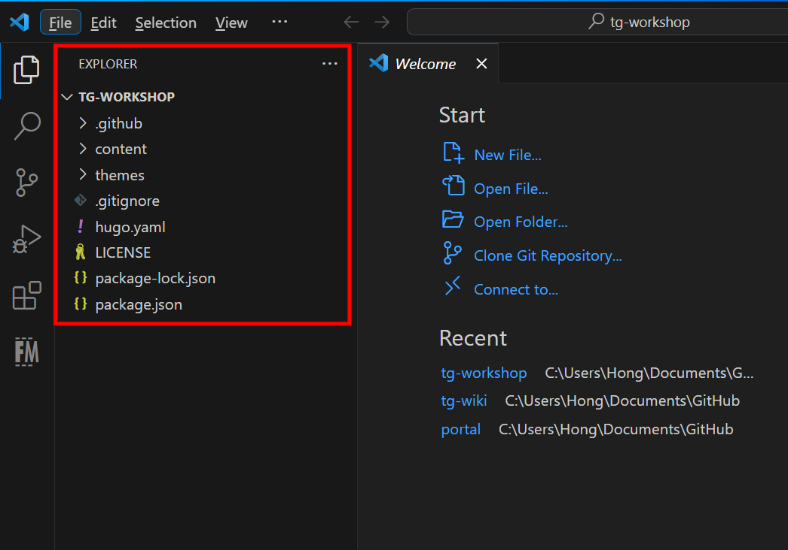

Most of time, we will start from cloning an existing Git repository from remote.  In this exercise, we will use the VSCode to clone a repository on GitHub.

1. open VSCode to clone a repository from GitHub

    

1. select the repository `dccn-tg/tg-workshop` and clone into a local directory.

    

1. Once the repository is cloned, choose __Open__ to open the cloned repository in the VSCode. You should see something like the screenshot below.  On the left-hand side, a list of files in the repository is shown.

    