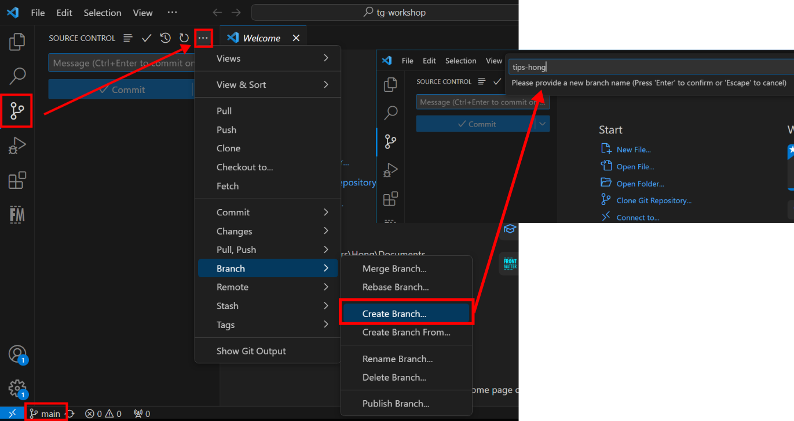
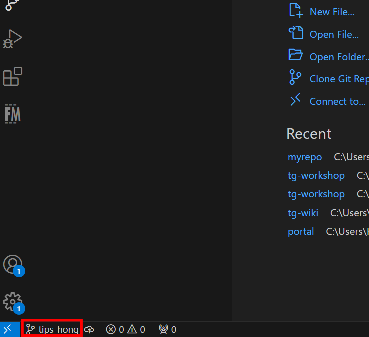
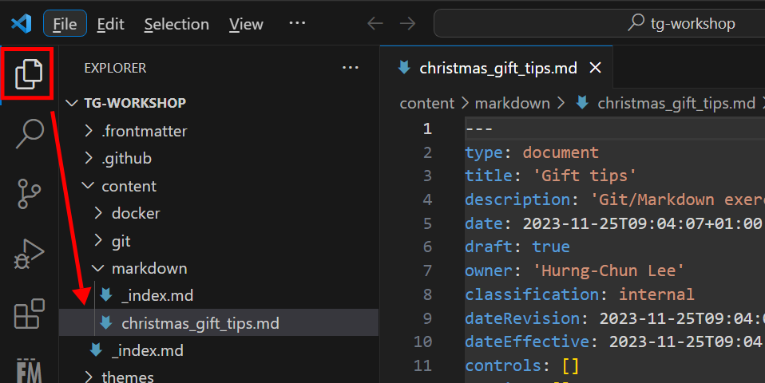
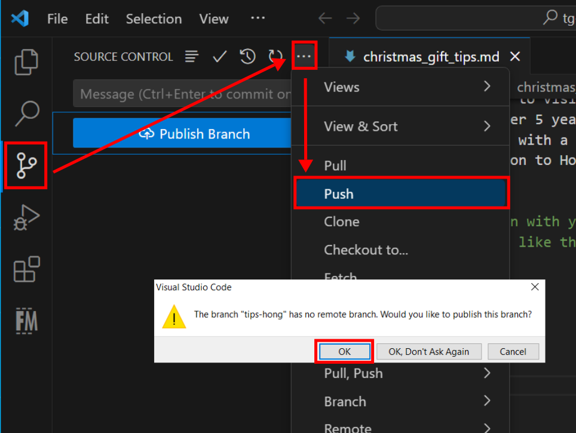
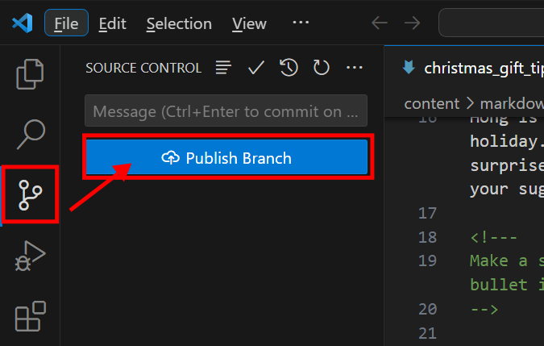

In this exercise, we will collaborate on a project.  You will experience a common workflow of making contributions to a remote repository hosted on GitHub.  This workflow consists of the following steps:

- create a new git branch locally,
- switch the file system to the new git branch, 
- make changes to files,
- commit changes to local git repository,
- push the new local branch to remote.

You will modify a file in the repository cloned in [the previous exercise](../git_clone/) to give your personal Christmas gift tips to a colleague who knows nothing about the Christmas and Santa Clause.



## Create new git branch

Enter the source-control panel in the vscode, click on the "more actions" icon, and create a new branch as shown in the screenshot below.  Also pay attention to the branch indicator at the bottom-left corner.

Give a name to the new branch and hit enter.  You will __enter__ the new branch right away.  This can be seen in the branch indicator at the bottom-left corner of the VSCode window.

## Switch between branches

You can switch between branches by clicking on the branch indicator followed by selecting a branch.  For the moment, you should just have two branches: the _main_ branch and the branch you just created.


When switching between branches, git swaps the content on the file system with the branch's content in the repository.

Since you just created the new branch based on the main branch, the content of your new branch should be identical to the conent of the main branch.


## Make changes

Make sure that you are at the new branch you just created.  Open the file-explore panel and double-click on the file `content -> markdown -> christmas_gift_tips.md`.

It is a plain-text file.  Following the instruction and example in the file to add your tips.

## Commit changes

Save and commit your tips. You can make several changes and commits.

## Push changes

Note that until now, all changes/commits you made are only local.  To make those changes/commits to remote, we do a git push.

Enter the source-control panel and push the changes to remote as shown in the screenshot below.  Because the branch where you made changes is not yet available in the remote, you will encounter a dialog to confirm the action of creating the new branch at the remote.  Select "OK" to push it.

You probably already noticed the button __Publish Branch__ in the source-control pannel.  In fact, you can also use it to push changes to the remote; however, it is only applicable for changes made in a new local branch. 

## Check on GitHub

Now you have pushed your changes to GitHub.  You should see your new branch on [this page](https://github.com/dccn-tg/tg-workshop/branches).