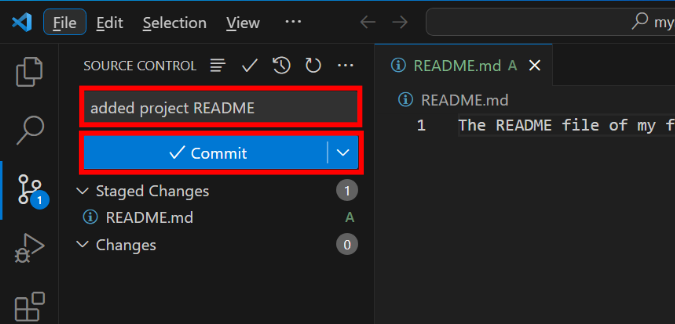
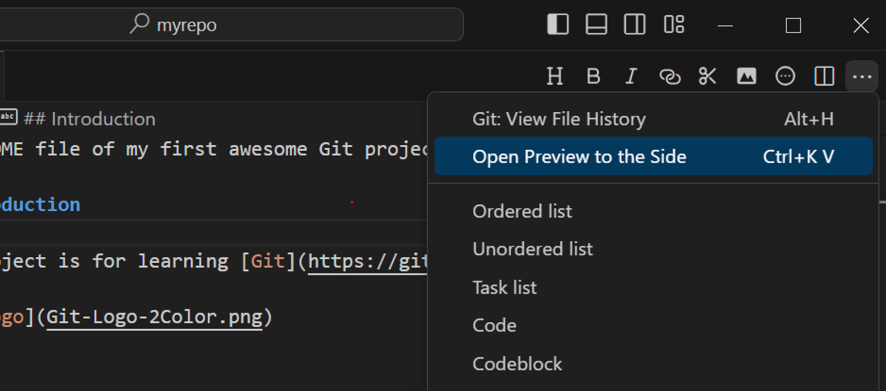
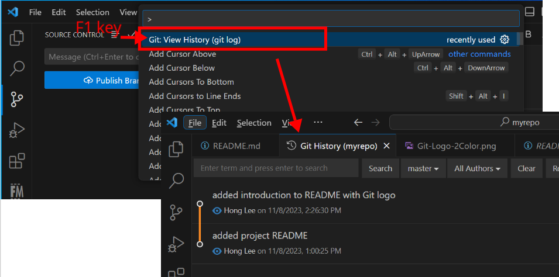
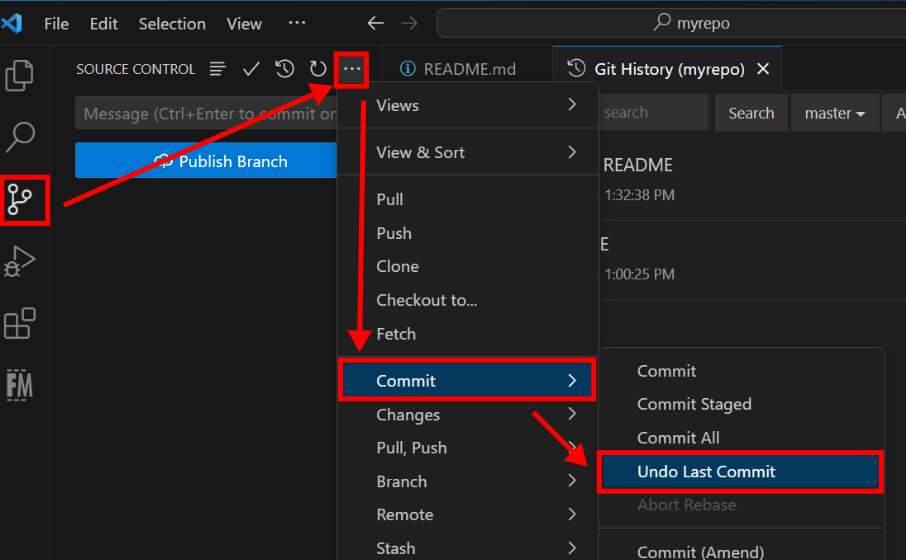

We will use the new git project initialized in the [previous exercise](../git_init/).

## Open git project

Open the VSCode, and click on the __Source Control__ icon on the side bar as indicated in the screenshot below.


Click on the __Open Folder__ button to load the git project folder.


## Add new file

After opening the folder in VSCode, create a new file called `README.md`, write some text in it and save the file.  After that, you will notice a numerical tag on the __Source Control__ icon.


The numerical tag shows the amount of changes made on the filesystem. If you click on the __Source Control__ icon, you will see the change concerns the `README.md` file we just added.

Because it is a new file, Git considers it as a __untracked__ file and therefore it is flagged with a `U`.

## Stage a change

Before we can commit this new file into the Git repository, we need to stage it.  This is done by clicking the `+` symbol next the `U` flag.  After that, you will see the change on `README.md` is moved into the stage area.


## Commit a change

After the changes are in the stage area, one can proceed to commit the file.  For committing a change into the Git repository, a message about the change is required.


When composing the commit message, try to follow the [Git 50/72 rule](https://dev.to/noelworden/improving-your-commit-message-with-the-50-72-rule-3g79).


Add a short sentence in the text field on top of the `Commit` button and click the `Commit` button.



___Congratulations! You made your first Git commit.___

## Make more changes

Let's make more changes to the README.md file.  Add the following lines to the file:

```markdown
## Introduction

This project is for learning [Git](https://git-scm.com).


```

Save the file.

Download the [Git Logo](https://git-scm.com/images/logos/downloads/Git-Logo-2Color.png) and add the logo into current project by dragging it into the VScode.

__You just wrote the README file in Markdown!!__  VSCode supports Markdown preview.  You can toggle the preview as shown in the screenshot below.



Now commit the changes with a message `added introduction to README with Git logo`.


A commit can involve multiple changes.  It is practicle that related changes are made in a single commit. 


## Check Git history

By default, VSCode supports viewing git change history via individual file's timeline.  However, the git log view provided by the __Git History__ extention is more intuitive.

Press the `F1` key to toggle the tool menu in VSCode and select __Git: View History (git log)__. You should see two commits we have just made in the newly opened tab.



## Roll back

Don't like the commited changes? You can always undo the last commit in VSCode. The change(s) involved in the undo-ed commit will be put back to the stage area.  One can then remove the change(s) from the stage area.  After that, the changes you made remain on the filesystem and can be further reversed or stashed completely.


