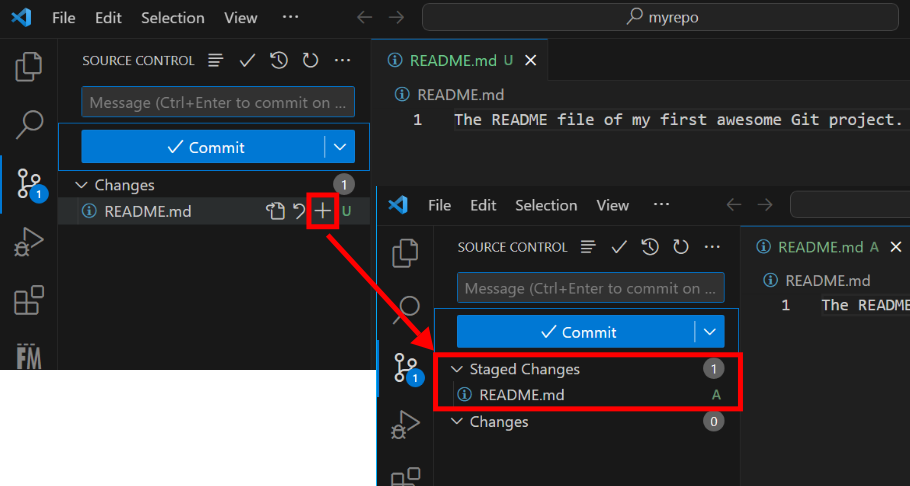

We will use the new git project initialized in the [previous exercise](../git_init/).

## Open git project

Open the VSCode, and click on the __Source Control__ icon on the side bar as indicated in the screenshot below.

Click on the __Open Folder__ button to load the git project folder.

## Add new file

After opening the folder in VSCode, create a new file called `README.md`, write some text in it and save the file.  After that, you will notice a numerical tag on the __Source Control__ icon.

The numerical tag indicates number of changes has been made since you open the folder.  If you click on the __Source Control__ icon, you will see the change concerns the `README.md` file we just added.

Because it is a new file, Git considers it as a __untracked__ file and therefore it is flagged with a `U`.

## Stage the change

Before we can commit this new file into the Git repository, we need to stage it.  This is done by click on the `+` symbol next the `U` flag.  After that, you will see the change on `README.md` is moved into the stage area.

## Commit the change

1. create a folder and add a new file

1. edit the new file and save it

1. stage the change

1. commit the change

1. view the commit log

    In VSCode, this can only be done by using the virtual terminal and run the `git log` command.

1. make more changes in different files

1. stage changes and commit

1. visualize the change logs

1. rollback commited changes

1. discard changes