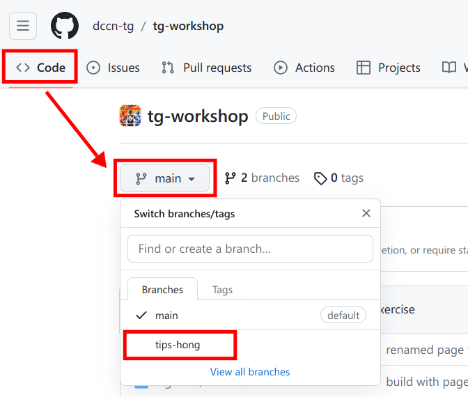
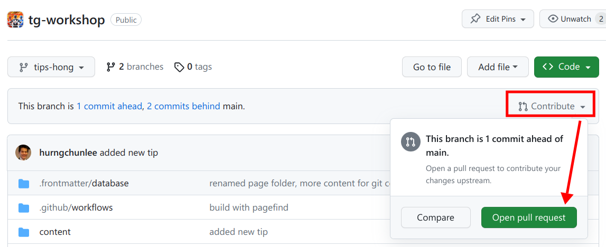
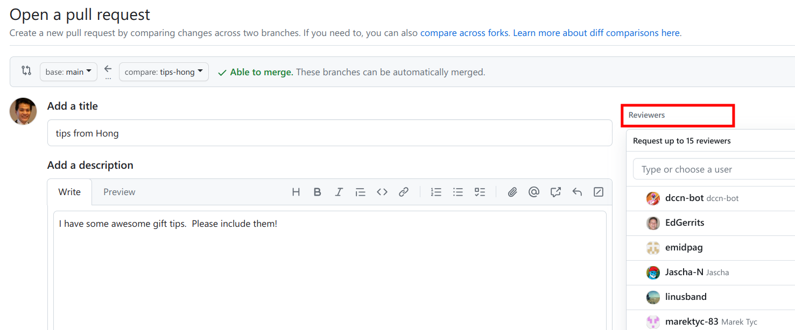
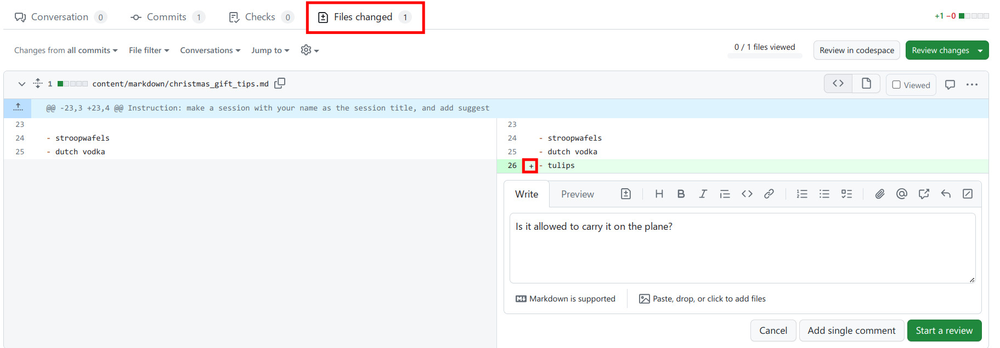
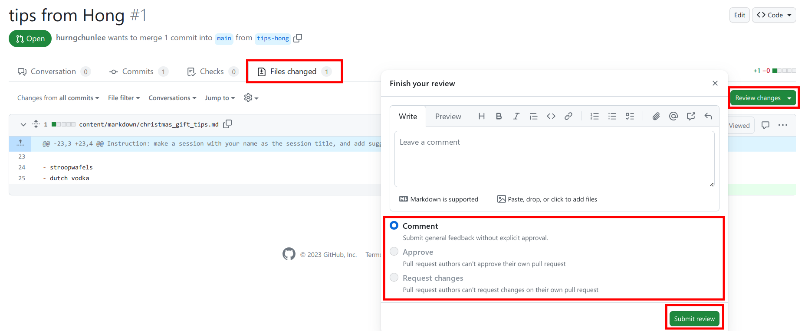

In the [previous exercise](../git_branch/) you have pushed your Christmas gift tips to a repository hosed on GitHub. You want your tips to be added to the final tip list that is a version maintained in the _main_ branch.

In this exercise, you will create a pull request, ask someone to review your changes and eventually get your changes merged into the main branch.

## Create pull request

On [the repository page](https://github.com/dccn-tg/tg-workshop), select the __Code__ tab and make switch to your branch as shown in the screenshot below.

In the branch, you will notice a panel summaring the differences between this branch and the main branch.  At the right of the panel, you see a "Contribute" button.  Click on it and select "Open pull request".

## Request for review


The pull request might contain merge conflicts.  You should always resolve merge conflicts before requesting a review on your changes.


When opening pull request, you should provide a title and some description about your changes.  Next to it, you can assign people to review your changes.

## Perform review

Once you are assigned as a reviewer of a pull request, you will receive an email notification from GitHub.   Go to the pull request page on GitHub to perform the review accordingly.

In the "Files changed" tab of the pull request, reviewer can provide inline comments as show in the screenshot below.

__Don't forget__ to conclude your round of review by click the "Submit review".

## Approve and merge

Once the change is approved by the reviewer, the pull request can be merged back to the main branch from which a new release can be made.  Merging can be done directly from the pull-request page. 

## Remove branch

After the merge is done, it is recommended to remove the branch from GitHub to avoid confusion.  Removing branch on GitHub doesn't mean that the branch is removed from your local Git repository.