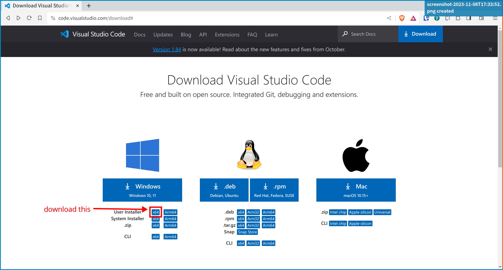

We will be using git from within the [VSCode](https://code.visualstudio.com/).

## Install Git

For Linux, git can be installed from the distribution's package repository.

For MacOS, git can be installed via [homebrew](https://brew.sh/), [macport](https://www.macports.org/) or the Xcode.

__Git for windows__ can be installed from the DCCN software center.

## Setup Git

Open a terminal (for Windows, use the __Git CMD__) and run the following commands to set your display name and email address that will be used in the Git version control history.  For example,

```bash
git config --global user.name "FIRSTNAME LASTNAME"
git config --global user.email "MYNAME@example.com"
```

For Windows, also enable the line-ending control to convert the line-ending code between Windows (i.e. the file system) and Linux (the git repository) automatically.

```cmd
git config --global core.autocrlf true
```


## Install VSCode

For Linux and MacOS, download the package in your favorite format from the [VSCode download page](https://code.visualstudio.com/download#).

On Windows, VSCode can be installed in user space (no administrator right is required).  On the [VSCode download page](https://code.visualstudio.com/download#), choose the __User Installer (x86)__ option.  See the screenshot below.



## Install VSCode extensions

Search and install the following two extensions in VSCode:

- Git History
- Hugo language and syntax support
- Front Matter CMS
